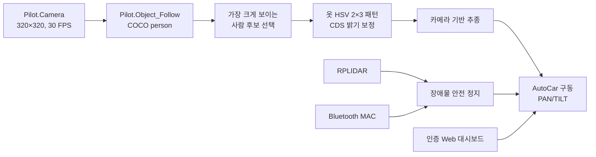
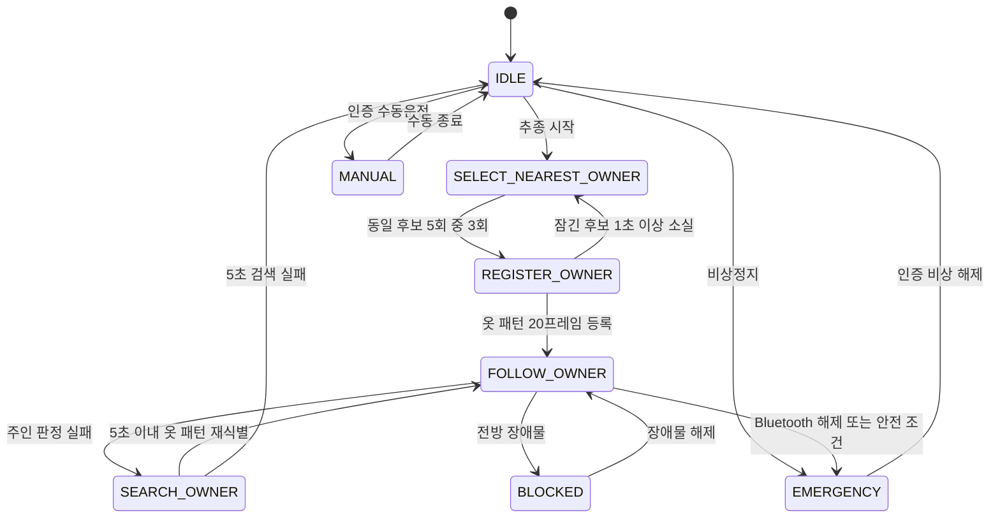

# AutoCAR 사용자 추종 시스템 개발 로그

> Hanback AutoCAR Prime에서 온디바이스 사람 검출, 옷 패턴 기반 사용자 재식별,
> LiDAR 안전 정지, Bluetooth 인증, 카메라 PAN/TILT 추적 및 Web 대시보드를 통합한 프로젝트다.

## 1. 프로젝트 개요

- 장비: Hanback AutoCAR Prime, NVIDIA Jetson Xavier 계열
- 운영체제: SODA OS 기반 Ubuntu 환경
- Python: 3.6.x
- CUDA: 10.2
- cuDNN: 8.0
- OpenCV: 4.3.0
- PyTorch: 1.4.0.post4
- torchvision: 0.5 계열
- 차량 제어: `pop.Pilot.AutoCar`
- 사람 검출: `pop.Pilot.Object_Follow`
- 카메라: 공유 `pop.Pilot.Camera`
- LiDAR: RPLIDAR 계열, ROS 없이 직접 사용
- 대시보드: Flask/Waitress, MJPEG 영상 및 Canvas LiDAR
- 장비 설치 경로: `/home/soda/Project/python/notebook`
- 현재 누적 버전: `v0.9.1`

얼굴 인식과 클라우드 추론은 사용하지 않는다. 모든 주요 판단은 장비 내부에서 수행한다.

## 2. 최종 동작 구조



### 사용자 등록 및 추종 상태



## 3. 날짜별 개발 기록

### 2026-07-13 — 요구사항과 기본 아키텍처

- AutoCAR 내부 실행 프로그램, Web 대시보드, systemd 서비스 및 tmux 디버깅 구조를 설계했다.
- ROS1을 사용할 수 없는 환경이므로 카메라, LiDAR 및 차량을 Python 어댑터로 직접 연결했다.
- 대시보드 기능을 영상, LiDAR 맵, 상태, 수동운전, 속도 설정 및 비상정지로 정의했다.
- Bluetooth 등록 MAC 연결 해제 시 차량을 즉시 정지하도록 안전 조건을 정의했다.
- 한국어 TTS 안내 문구로 `사용자를 찾을 수 없습니다.`를 지정했다.
- 영상 크기는 가로와 세로 모두 32의 배수만 허용하도록 검증을 추가했다.

### 2026-07-14 — 장비 환경과 한백 예제 검증

- Jetson 장비에서 CUDA, PyTorch, OpenCV, POP 라이브러리와 카메라 동작을 확인했다.
- 한백 예제의 `Pilot.Camera`와 `Pilot.Object_Follow` 조합으로 `person` 검출을 확인했다.
- 예제 모델은 장비 종류에 따라 YOLOv4-tiny 또는 SSD MobileNet TensorRT를 사용한다.
- POP 모델 첫 로딩과 워밍업 이후의 추론 시간을 측정했다.
- RPLIDAR `/dev/ttyUSB0`, 115200 baud 동작을 확인했다.
- BlueZ D-Bus에서 등록 장치의 `Paired`, `Connected`, `Trusted` 상태를 확인했다.
- 실제 장비 소스와 Windows 작업공간 소스가 다를 수 있으므로 누적 설치 시 선택적 설정 병합과 백업이 필요하다고 정리했다.

### 2026-07-15 — 추종 제어와 성능 안정화

- 카메라 30 FPS, AI 제어 루프 8 FPS, 대시보드 5 FPS로 역할을 분리했다.
- 최신 프레임 하나만 유지하고 오래된 프레임을 버리도록 카메라 읽기 구조를 변경했다.
- 주기적인 가비지 컬렉션, RSS 측정 및 지연시간 이동평균을 추가했다.
- 대시보드에 추론, 처리, 프레임 나이, API RTT 및 추정 종단 지연시간을 표시했다.
- 차량 이동 최소 속도를 50, 대시보드 속도 범위를 50~99로 설정했다.
- LiDAR 주인 거리는 참고값으로만 사용하고 속도 계산에서는 제외했다.
- 속도는 카메라 사람 박스 높이 비율을 기준으로 계산하도록 변경했다.
- LiDAR는 장애물 정지와 비상정지에 계속 사용했다.
- 초기 카메라 PAN/TILT 적용 및 사용자 방향에 따른 카메라 자동 이동을 추가했다.
- CDS 센서를 이용해 등록 시점과 현재 밝기 차이를 보정하는 옷 패턴 변형을 저장했다.
- Pose C++ 파서 충돌과 PyTorch/TLS 충돌을 분리해 진단했다.
- Pose 기반 손 흔들기와 Y 포즈를 시험했으나 장시간 안정성 및 사용자 편의 문제로 최종 구조에서 제거했다.

### 2026-07-16 — 사용자 등록 단순화와 POP 검출 복구

- ArUco 마커 인증을 시험했으나 실제 카메라 거리와 마커 픽셀 크기 문제로 최종 방식에서 제거했다.
- 화면에서 사람 박스 높이가 가장 큰 사람을 가장 가까운 사람으로 간주하도록 변경했다.
- 같은 track ID가 5회 중 3회 이상 가장 가까운 후보이면 등록 대상을 잠그도록 했다.
- 후보 잠금 이후 다른 사람이 더 크게 보이더라도 등록 대상은 변경하지 않는다.
- 잠긴 사람이 1초 이상 사라지면 등록을 취소하고 후보 선택을 다시 시작한다.
- 옷 패턴 20프레임 등록 후 정상 추종을 시작하도록 했다.
- 추종 중 주인을 놓치면 정지 상태에서 옷 패턴으로 최대 5초간 재검색한다.
- 5초 검색 실패 후 다른 사람을 자동 등록하지 않고 `IDLE`로 정지하도록 했다.
- 카메라 및 검출 해상도를 한백 예제에서 검증한 320×320으로 복귀했다.
- 초기 카메라 위치를 PAN 90°, TILT 0°로 변경했다.
- 인증 대시보드에 TILT 0~90° 슬라이더와 적용 API를 추가했다.
- 대시보드 TILT 변경값을 현재 런타임 자동 추적 기준각도로 반영했다.
- 설정은 `backend=pop`이었지만 누적 패키지의 검출 코드가 YOLOv5만 실행하던 회귀를 발견했다.
- `Pilot.Camera`와 `Pilot.Object_Follow`를 공유하는 POP 검출 경로를 복구했다.
- POP COCO 결과에서 모든 `person` 박스를 추출해 옷 패턴 비교에 전달하도록 했다.
- POP 카메라와 OpenCV 카메라가 CSI 장치를 동시에 열지 않도록 단일 카메라 구조로 수정했다.

## 4. 주요 설계 결정

### 4.1 가장 가까운 사용자 판정

단안 카메라만으로 정확한 실제 거리를 계산할 수 없고 2D LiDAR는 사람의 다리 위치를 놓칠 수 있다.
따라서 초기 등록에서는 사람 박스 높이가 가장 큰 대상을 가장 가까운 사람으로 간주한다.

후보는 약 0.6초 동안 5회 검사하며, 동일 track ID가 3회 이상 선택되면 잠근다.
등록 잠금 이후에는 더 가까운 다른 사람이 들어와도 대상이 바뀌지 않는다.

### 4.2 옷 패턴 재식별

- 사람 박스에서 의복 영역만 잘라 사용한다.
- 의복 영역을 2행×3열로 나누어 위치별 HSV 히스토그램을 계산한다.
- 밝기 배율 0.6, 0.8, 1.0, 1.2, 1.4의 예상 패턴을 함께 저장한다.
- CDS 등록값과 현재값의 비율로 밝기 후보를 선택한다.
- track 연속성, 옷 외형 유사도 및 후보 간 점수 차이를 함께 사용한다.
- 후보가 없거나 유사한 사람이 여러 명이면 차량을 정지한다.

### 4.3 LiDAR 정책

- 주인과의 LiDAR 거리는 대시보드 참고값으로만 사용한다.
- LiDAR 거리가 없더라도 카메라 주인 추종을 계속할 수 있다.
- 전방 장애물 일반 정지: 0.2m
- 비상정지: 0.1m
- LiDAR 장치 오류 또는 Bluetooth 연결 해제는 활성 추종 중 안전정지를 발생시킨다.

### 4.4 영상과 지연 정책

- 카메라: 320×320, 30 FPS
- POP 사람 검출 및 제어 루프: 목표 8 FPS
- 대시보드 MJPEG: 5 FPS
- 영상 큐를 누적하지 않고 최신 프레임만 사용한다.
- JPEG 인코딩과 대시보드 전송은 차량 제어 판단과 분리한다.

## 5. 해결한 주요 문제

| 문제 | 원인 | 처리 |
|---|---|---|
| 대시보드 Bluetooth 미연결 표시 | BlueZ 조회 실패 및 중복 프로세스 | D-Bus 상태 확인, 단일 프로세스 실행 |
| `Cannot allocate memory` | 실제 RAM 부족이 아닌 네이티브 TLS/라이브러리 충돌 가능성 | 사용자 로컬 torch 제거, 시스템 JetPack PyTorch 유지 |
| `libgomp ... static TLS block` | POP와 다른 PyTorch 빌드 혼재 | `~/.local`의 잘못된 torch/torchvision 제거 |
| YOLO 로컬 로딩 실패 | PyTorch 1.4에 `source="local"` 미지원 | 로컬 `hubconf.py` 직접 로딩 호환 코드 추가 |
| YOLO 실행 중 패키지 자동 설치 | 구형 YOLOv5 요구사항 검사 | 런타임 자동 설치 차단 |
| Pose 단계 프로세스 `-11` 종료 | `trt_pose` 네이티브 파서 충돌 | 안전 파서로 교체 후 최종적으로 Pose 제거 |
| 실행 스크립트 종료 지연 | 셸 자식 프로세스가 남음 | 프로세스 그룹 및 `autocar.main` PID 기준 종료 |
| 카메라·LiDAR 대시보드 지연 | 프레임 누적 및 무거운 표시 | 최신 프레임 유지, 표시 FPS 제한, 지연 측정 |
| 사람 검출이 한백 예제보다 저하 | `backend=pop` 설정이 YOLOv5 전용 코드에 의해 무시됨 | POP 공유 카메라와 `Object_Follow` 경로 복구 |
| Windows ZIP을 Linux에서 설치 실패 | ZIP 내부 역슬래시 경로 | POSIX ZIP 생성 및 설치기 멤버 경로 정규화 |

## 6. 현재 설정 요약

```json
{
  "camera": {
    "width": 320,
    "height": 320,
    "inference_width": 320,
    "inference_height": 320,
    "fps": 30
  },
  "detector": {
    "backend": "pop",
    "confidence": 0.45,
    "tracking_iou": 0.3,
    "max_missing": 15
  },
  "selection": {
    "sample_count": 5,
    "min_hits": 3,
    "locked_loss_seconds": 1.0
  },
  "owner": {
    "registration_frames": 20,
    "search_seconds": 5.0
  },
  "camera_tracking": {
    "pan_center": 90.0,
    "tilt_center": 0.0,
    "tilt_min": 0.0,
    "tilt_max": 90.0
  },
  "driving": {
    "min_follow_speed": 50,
    "max_speed": 99,
    "stop_distance_m": 0.2,
    "emergency_distance_m": 0.1
  }
}
```

장비의 Bluetooth MAC, Web 계정, 비밀번호와 secret은 저장소에 커밋하지 않는다.

## 7. 설치

최신 누적 파일:

```text
KNU_RC_DEVICE_POP_NEAREST_OWNER_v0.9.1.zip
install_device_nearest_owner.py
```

두 파일을 `/home/soda/Project/python/notebook`에 복사한 뒤 기존 프로그램을 종료하고 설치한다.

```bash
cd /home/soda/Project/python/notebook
pkill -TERM -f autocar.main || true
python3 install_device_nearest_owner.py
```

설치기는 기존 소스와 `config/autocar.json`을 `backups/` 아래 ZIP으로 백업한 후 누적 소스를 설치한다.

## 8. 실행 확인

```bash
cd /home/soda/Project/python/notebook
./run-autocar.sh
```

대시보드:

```text
http://<AutoCAR-IP>:8080
```

정상 시작 로그에서 다음 항목을 확인한다.

```text
Detector backend: pop
Camera: 320x320 at 30 FPS
Inference: 320x320
Initial camera PAN/TILT: 90 / 0 degrees
```

## 9. 검증 현황

완료된 로컬 검증:

- Python 단위 테스트 40개 통과
- 대시보드 JavaScript 문법 검사 통과
- 누적 설치 시뮬레이션 통과
- Linux용 POSIX ZIP 내부 경로 검사 통과
- POP COCO 결과의 복수 `person` 변환 테스트 통과
- 후보 잠금 이후 다른 사람으로 등록 대상이 바뀌지 않는 테스트 통과
- 후보 1초 소실 시 선택 재시작 테스트 통과
- 옷 패턴 5초 재탐색과 실패 시 IDLE 정지 테스트 통과
- 대시보드 TILT 범위 및 런타임 적용 테스트 통과

## 10. 남은 실장비 검증

1. v0.9.1에서 `Pilot.Object_Follow` 내장 모델이 정상 로딩되는지 확인
2. POP 카메라가 320×320, 30 FPS로 장시간 안정적으로 갱신되는지 확인
3. 한 명과 여러 명 환경에서 전체 `person` 박스가 대시보드에 표시되는지 확인
4. 가장 가까운 후보 잠금과 20프레임 옷 패턴 등록 시간을 확인
5. 등록 중 다른 사람이 더 가까이 들어와도 대상이 유지되는지 확인
6. 밝은 곳과 어두운 곳에서 CDS 보정 옷 패턴 재식별률 비교
7. 초기 TILT 0°와 대시보드 0~90° 조절 방향 확인
8. 추종 중 자동 PAN/TILT와 수동 TILT 적용의 상호작용 확인
9. 30분 이상 실행 후 추론 FPS, RSS 및 영상 지연 확인
10. 바퀴를 지면에서 띄운 상태에서 속도 50~99, 장애물 0.2m 및 비상정지 0.1m 검증

## 11. 운영 주의사항

- Jetson용 시스템 PyTorch를 일반 PyPI 패키지로 덮어쓰지 않는다.
- `~/.local`에 별도 torch/torchvision을 설치하지 않는다.
- POP 카메라와 OpenCV GStreamer 카메라를 동시에 실행하지 않는다.
- AutoCAR 프로세스를 두 개 이상 실행하지 않는다.
- 첫 실차 시험은 바퀴를 지면에서 띄우고 진행한다.
- 물리 전원 스위치를 소프트웨어 비상정지와 별개의 최종 안전수단으로 유지한다.
- 인증정보, MAC 주소와 secret이 포함된 설정 파일은 GitHub에 올리지 않는다.

